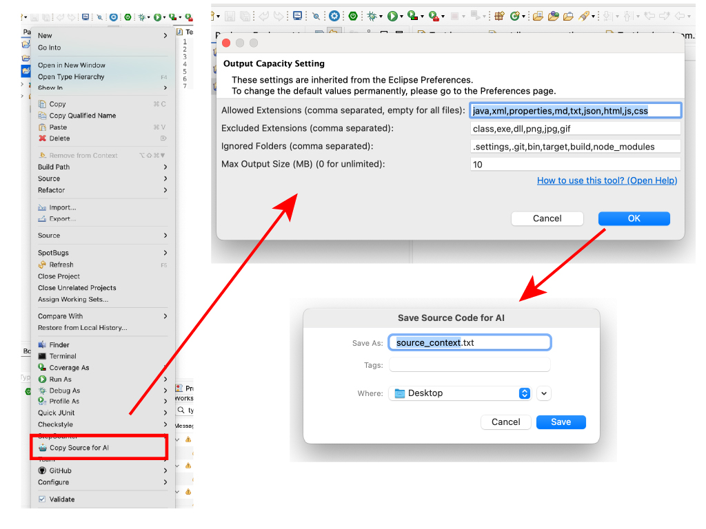

# 🤖 JHappy AI Exporter (JHappy4AI)

*[Read this in Japanese (日本語)](#日本語)*

**JHappy AI Exporter** is an Eclipse plugin designed to bridge the gap between your development workspace and AI tools like ChatGPT, Gemini, and Claude. It seamlessly aggregates your selected source code into a single, LLM-optimized text file.

## ✨ Key Features
* **Smart Aggregation:** Merges multiple files and folders into a single Markdown-formatted text file (`.txt`).
* **Token Saving (Filtering):** Exclude unnecessary binaries or build folders (e.g., `.class`, `target/`, `bin/`) via customizable whitelists and blacklists.
* **Context Window Protection:** Set a maximum output size limit (in MB). The export safely truncates with a warning if the limit is reached.
* **Encoding Safety:** Automatically reads files using their respective Eclipse project encodings and exports everything unified in **UTF-8**.
* **Multilingual:** UI and internal Help contents fully support both English and Japanese.

## Installation

To install **JHappy4AI** in your Eclipse IDE, please follow these steps:

1. Copy the following Update Site URL:
   `https://tatoo2018.github.io/JHappy4AI/`
2. In Eclipse, go to **Help** > **Install New Software...**.
3. Click the **Add...** button.
4. Enter `JHappy4AI` in the Name field and paste the URL above into the Location field.
5. Click **Add**, then select **JHappy AI Exporter** from the list.
6. Follow the prompts to complete the installation and restart Eclipse.

> **Note:** Since this is a self-signed plugin, you may see a "Security Warning" during installation. Please click "Install anyway" to proceed.

## 🚀 How to Use
1. Select projects, folders, or files in the **Package Explorer**.
2. Right-click and choose **🤖 Copy Source for AI**.
3. Adjust temporary filters and the MB size limit in the popup dialog.
4. Click **OK** and save the `jhappy_source_context.txt` file.
5. Drag & drop the generated file into your favorite AI chat!

## ⚙️ Configuration
You can change the default extensions and size limits by navigating to:
`Window` > `Preferences` > `JHappy AI Exporter Settings`

## 📄 License
This project is licensed under the MIT License - see the [LICENSE](LICENSE) file for details.

---

<h1 id="日本語">🤖 JHappy AI Exporter (日本語)</h1>

**JHappy AI Exporter** は、Eclipse上のソースコードをChatGPTやGeminiなどのAIツールに渡す作業を劇的に効率化するプラグインです。選択したプロジェクト資産を、LLM（大規模言語モデル）が最も理解しやすい形式の1つのテキストファイルに集約・出力します。

## ✨ 主な機能
* **スマート結合:** 複数のファイルやフォルダを解析し、Markdown形式で区切られた1つのテキストファイルに出力します。
* **トークン節約（フィルタリング）:** 拡張子（ホワイトリスト/ブラックリスト）やフォルダ名指定により、不要なバイナリやビルド生成物を除外します。
* **コンテキスト長保護（MB制限）:** AIの入力制限に合わせて、出力ファイルの最大サイズ（MB単位）を指定可能。制限到達時は安全に書き込みを中断し、警告を挿入します。
* **文字コード自動統一:** 各ソースファイルの元の文字コード（Shift-JISなど）に関わらず、すべて **UTF-8** に変換して出力し、AI側での文字化けを防ぎます。
* **完全日本語対応:** メニュー、ダイアログ、および内蔵のヘルプシステムはすべて日本語環境に対応しています。

## インストール方法 (Japanese)

Eclipse IDE に **JHappy4AI** をインストールするには、以下の手順に従ってください。

1. 次のアップデートサイトの URL をコピーします：
   `https://[あなたのユーザー名].github.io/JHappy4AI/`
2. Eclipse を起動し、メニューの **[ヘルプ] (Help)** > **[新規ソフトウェアのインストール...] (Install New Software...)** を選択します。
3. **[追加...] (Add...)** ボタンをクリックします。
4. 「名前」欄に `JHappy4AI`、「ロケーション」欄に先ほどコピーした URL を入力し、**[追加]** を押します。
5. リストに表示された **JHappy AI Exporter** にチェックを入れます。
6. ウィザードの指示に従い、インストールを完了させて Eclipse を再起動してください。

> **注意:** 本プラグインは署名されていないため、インストール中に「セキュリティ警告」が表示されます。そのまま **[インストールを続行] (Install anyway)** を選択して進めてください。

## 🚀 使い方
1. **パッケージ・エクスプローラー**で、対象のプロジェクトやファイルを選択します。
2. 右クリックメニューから **🤖 AI用にソースを結合して出力** を選択します。
3. ダイアログで今回適用するフィルタや容量制限を確認・調整します。
4. **OK** を押してファイルを保存します。
5. 出力されたテキストファイルを、AIのチャット画面にそのまま貼り付け（ドラッグ＆ドロップ）してください！

## ⚙️ デフォルト設定の変更
毎回同じ設定を入力する手間を省くため、以下のメニューからデフォルト値を変更できます：
`ウィンドウ` ＞ `設定` ＞ `JHappy AI エクスポート設定`

## 📄 ライセンス
本プロジェクトは MIT License の下で公開されています。詳細は [LICENSE](LICENSE) ファイルをご覧ください。
